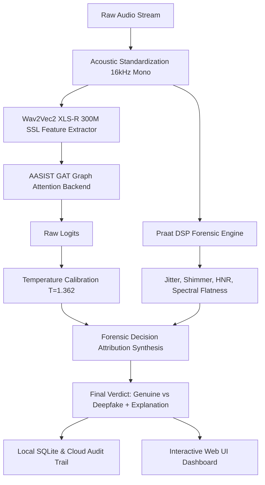

# 🛡️ VoxGuard AI: Explainable Multilingual Deepfake Audio Detection System

[](https://www.python.org/)
[](https://fastapi.tiangolo.com/)
[](https://pytorch.org/)
[](https://onnxruntime.ai/)
[](LICENSE)

**VoxGuard AI** is a comprehensive, production-ready machine learning framework and interactive web dashboard engineered to detect AI-generated and spoofed synthetic voices across multilingual speech corpora. Combining **self-supervised transformer representations (Wav2Vec2 XLS-R 300M)**, **Graph Attention Networks (AASIST)**, and **clinical digital signal processing (DSP) biomarkers**, VoxGuard provides both high-accuracy detection and human-readable forensic explanations.

---

## 🌟 Key Features

1. **Multilingual Speech Ingestion**:
   - Native support for 5 regional and global languages: **English, Hindi (हिंदी), Tamil (தமிழ்), Telugu (తెలుగు), and Malayalam (മലയാളം)**.
2. **Hybrid Neural Architecture**:
   - **Front-End**: Multilingual self-supervised **Wav2Vec 2.0 XLS-R (300M)** feature extraction.
   - **Back-End**: **AASIST Graph Attention Network (GAT)** for spectro-temporal artifact modeling.
3. **Explainable AI (XAI) Forensic Engine**:
   - Extracts glottal pulse biomarkers via **Praat / Parselmouth** and **Librosa**:
     - **Jitter (Pitch Stability)**
     - **Shimmer (Amplitude Dynamics)**
     - **Harmonics-to-Noise Ratio (HNR)**
     - **Spectral Flatness & Anomaly Heatmaps**
   - Synthesizes neural patterns with acoustic physical measurements into plain-English explanations.
4. **Post-Hoc Temperature Calibration**:
   - Calibrated via Expected Calibration Error (ECE) minimization ($T=1.362$) to prevent neural overconfidence.
5. **Interactive Glassmorphic Web Dashboard (`web/`)**:
   - Modern dark-mode UI with live microphone recording, drag-and-drop file upload, real-time waveform visualizer, confidence gauge meters, and audit logs.
6. **Dual Persistence Layer**:
   - Automatic local **SQLite audit trail (`logs/audit_trail.db`)** for offline college presentations.
   - Optional **Supabase cloud logging** for enterprise deployment.
7. **College Academic Package**:
   - Full Project Report Synopsis in [`docs/PROJECT_REPORT.md`](docs/PROJECT_REPORT.md).
   - Top 25 Viva Voce & Technical Defense Q&A in [`docs/VIVA_QUESTIONS_AND_ANSWERS.md`](docs/VIVA_QUESTIONS_AND_ANSWERS.md).

---

## 🏛️ System Architecture



---

## 📁 Repository Directory Structure

```text
VoxGuard-AI-Deepfake-Detector/
├── docs/
│   ├── PROJECT_REPORT.md              # Complete Academic Project Synopsis & Report
│   └── VIVA_QUESTIONS_AND_ANSWERS.md  # 25 Viva Voce Examination Questions & Answers
├── models/
│   └── best_model.onnx                # Trained ONNX model weights (place here)
├── sample_audio/                      # Generated test audio samples for instant demos
├── scripts/
│   ├── augment_data.py                # Speed and AWGN noise augmentation engine
│   ├── demo_cli.py                    # Terminal demonstration runner
│   ├── download_fakes.py              # Synthetic speech harvester (IndicSynth + GaryStafford)
│   ├── download_real.py               # Human speech harvester (Mozilla Common Voice)
│   └── generate_test_samples.py       # Instant sample audio synthesizer
├── src/
│   ├── __init__.py
│   ├── api/
│   │   ├── __init__.py
│   │   ├── config.py                  # System settings & acoustic thresholds
│   │   ├── database.py                # Dual SQLite + Supabase persistence
│   │   ├── inference.py               # DSP & ONNX inference engine
│   │   └── main.py                    # FastAPI REST application
│   └── model/
│       ├── __init__.py
│       └── architecture.py            # PyTorch Wav2Vec2 + AASIST GAT architecture
├── training/
│   ├── __init__.py
│   ├── calibrate.py                   # Temperature scaling & ECE calibration
│   ├── dataset.py                     # Multilingual PyTorch dataset loader
│   ├── generate_training_notebook.py  # Notebook generation script
│   ├── train.py                       # AMP mixed precision training loop
│   └── training_notebook.ipynb        # Kaggle/Colab Jupyter training notebook
├── web/
│   ├── app.js                         # Web Audio visualizer & REST client
│   ├── index.html                     # Dark-mode glassmorphism dashboard
│   └── style.css                      # Modern CSS design system
├── .env.example                       # Environment configuration template
├── .gitignore
├── Dockerfile                         # Container definition
├── docker-compose.yml                 # Multi-container deployment
├── requirements.txt                   # Project dependencies
└── README.md                          # Project documentation
```

---

## 🚀 Quick Start Guide

### 1. Environment Installation
Clone and navigate to the project directory, then create a virtual environment:

```bash
cd VoxGuard-AI-Deepfake-Detector
python -m venv venv

# Windows:
venv\Scripts\activate

# Linux / macOS:
source venv/bin/activate

# Install dependencies:
pip install -r requirements.txt
```

### 2. Generate Sample Test Audios
Generate demo audio files to test the system immediately:

```bash
python scripts/generate_test_samples.py
```

### 3. Run the Interactive Web Dashboard & API
Start the FastAPI server:

```bash
python -m uvicorn src.api.main:app --host 0.0.0.0 --port 8000 --reload
```

Open your browser and navigate to:
👉 **`http://localhost:8000`** (Interactive Web Dashboard)  
👉 **`http://localhost:8000/docs`** (Swagger API Documentation)

---

## 💻 Command-Line (CLI) Demonstration

For quick terminal demonstrations or examiner evaluations:

```bash
# Analyze a sample audio file locally:
python scripts/demo_cli.py --file sample_audio/sample_synthetic_robotic.wav --language English

# Test via the running HTTP REST API:
python scripts/demo_cli.py --file sample_audio/sample_organic_human.wav --api
```

---

## 📡 REST API Reference

### Detection Endpoint
`POST /api/voice-detection`

#### Request Headers
```http
Content-Type: application/json
x-api-key: voxguard-college-eval-key
```

#### Request Payload
```json
{
  "language": "English",
  "audioFormat": "mp3",
  "audioBase64": "<BASE64_ENCODED_AUDIO_STRING>"
}
```

#### Successful Response
```json
{
  "status": "success",
  "language": "English",
  "classification": "HUMAN",
  "confidenceScore": 0.9642,
  "explanation": "Clear, studio-grade organic vocal pitch trajectory (Jitter: 0.42%). Natural vocal resonance confirmed.",
  "metrics": {
    "jitter": 0.0042,
    "shimmer": 0.0215,
    "hnr": 24.60,
    "spectral_flatness": 0.0034,
    "confidence_weights": {
      "Neural_Pattern_Match": 0.70,
      "Acoustic_Signal_Artifacts": 0.30
    }
  }
}
```

---

## 🐳 Docker Deployment

To run the containerized application with Docker Compose:

```bash
docker-compose up --build
```

Access the service at `http://localhost:8000`.

---

## 📚 Academic Documentation & Project Viva

- **Project Synopsis / Detailed Report**: [`docs/PROJECT_REPORT.md`](docs/PROJECT_REPORT.md)
- **Top 25 Viva Voce Questions & Answers**: [`docs/VIVA_QUESTIONS_AND_ANSWERS.md`](docs/VIVA_QUESTIONS_AND_ANSWERS.md)

---

## 📄 License
This project is licensed under the MIT License - see the [LICENSE](LICENSE) file for details.
